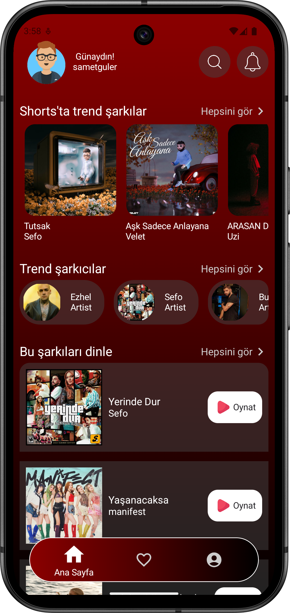
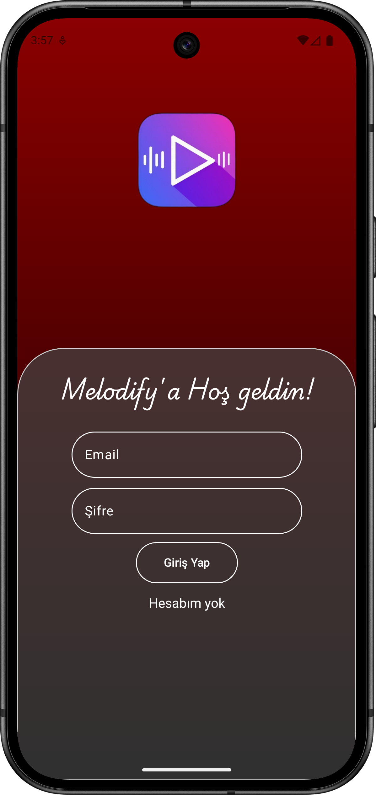
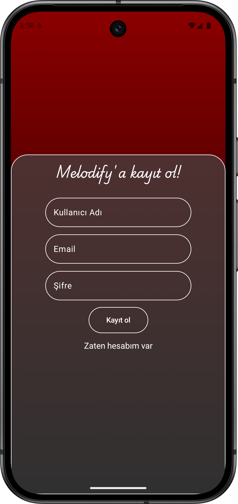
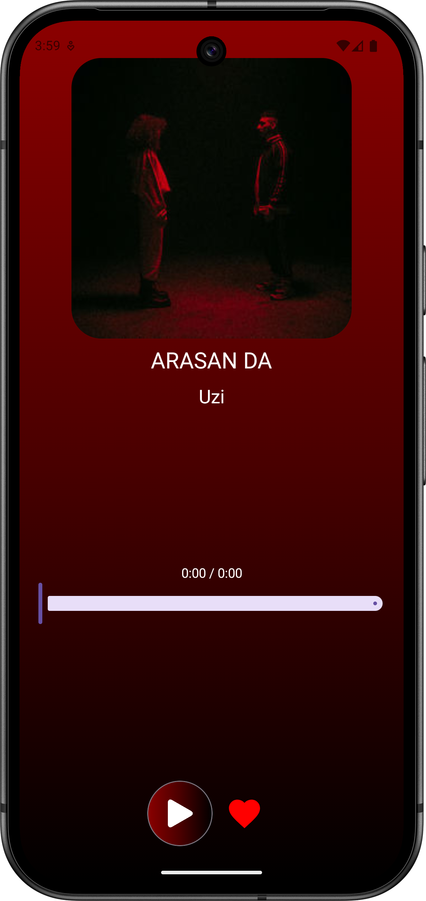
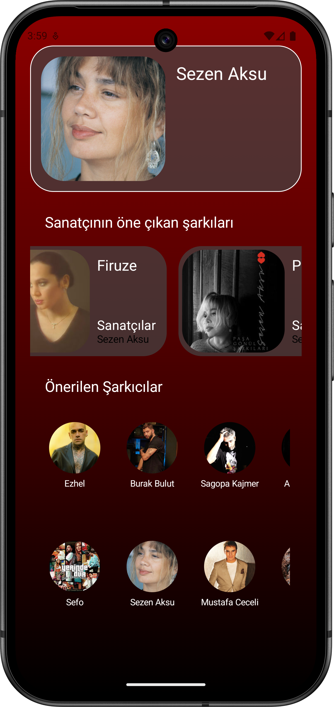
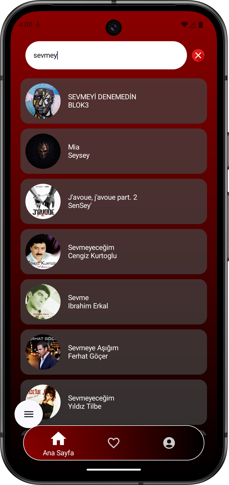

# Melodify: Kotlin Jetpack Compose Music Player App

**Melodify**, Kotlin ve Jetpack Compose kullanılarak geliştirilmiş modern bir müzik dinleme uygulamasıdır. Uygulama, Deezer API üzerinden verileri çekerek
 kullanıcıya zengin bir müzik deneyimi sunar. MVVM mimarisi, repository, viewmodel, service ve Clean Architecture prensiplerine uygun şekilde organize edilmiştir.

Uygulamada kullanılan teknolojiler ve özellikler:

- **Kotlin & Jetpack Compose**: Modern Android UI ve reactive yapılar.
- **Navigation**: Sayfalar arası geçiş ve parametre ile navigasyon.
- **Retrofit & Deezer API**: Müzik verilerini API üzerinden asenkron olarak çekmek için.
- **Coil**: Albüm kapaklarını ve görselleri yüklemek için.
- **Firebase**: Kullanıcı kaydı, giriş ve favori müzikler için backend.
- **MVVM + LiveData**: Verileri gözlemleme ve UI güncelleme.
- **Animation & UI**: Play/Pause animasyonları kullanıcı giriş kısmındaki animasyonlar ve modern kullanıcı arayüzü.
- **Error Handling**: API ve network hatalarını yöneterek uygulamanın çökmesini engelleme.

**Özellikler:**

- Kullanıcı kaydı ve girişi
- Müzik dinleme (play/pause, slider ile konum değişikliği)
- Favori müzikleri ekleme/çıkarma
- Albüm ve şarkı detaylarını görüntüleme
- Responsive ve modern arayüz

---

# Melodify: Music Player App built with Kotlin Jetpack Compose

**Melodify** is a modern music streaming application developed with Kotlin and Jetpack Compose. The app fetches music data from Deezer API, providing a rich user experience. The project is structured using MVVM architecture with repositories, viewmodels, services, and Clean Architecture principles.

Technologies and features used:

- **Kotlin & Jetpack Compose**: Modern Android UI and reactive design.
- **Navigation**: Page navigation with parameters.
- **Retrofit & Deezer API**: Asynchronous API calls for music data.
- **Coil**: Loading album covers and images.
- **Firebase**: Backend for user authentication and favorite music.
- **MVVM + LiveData**: Observe data and update UI.
- **Animation & UI**: Play/Pause animations and modern interface.
- **Error Handling**: Handles API and network errors to prevent crashes.

**Features:**

- User registration and login
- Music playback (play/pause, seek slider)
- Add/remove favorite music
- Display album and track details
- Responsive and modern interface

---

### Screenshots

<table align="center">
  <tr>
    <td></td>
    <td>&nbsp;&nbsp;&nbsp;&nbsp;</td>
    <td></td>
    <td>&nbsp;&nbsp;&nbsp;&nbsp;</td>
    <td></td>
  </tr>
  <tr>
    <td></td>
    <td>&nbsp;&nbsp;&nbsp;&nbsp;</td>
    <td></td>
    <td>&nbsp;&nbsp;&nbsp;&nbsp;</td>
    <td></td>
  </tr>
</table>

